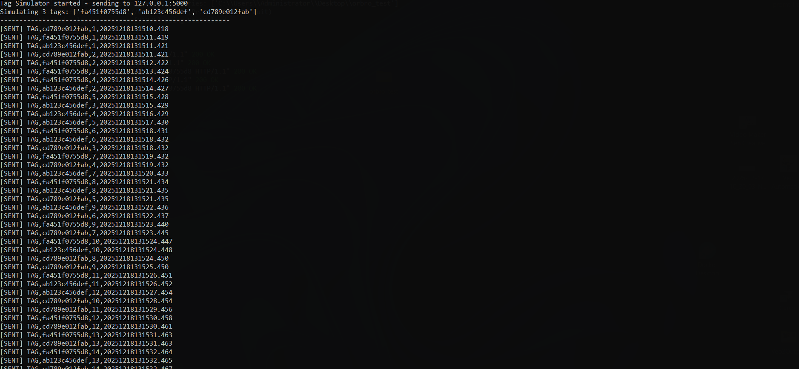
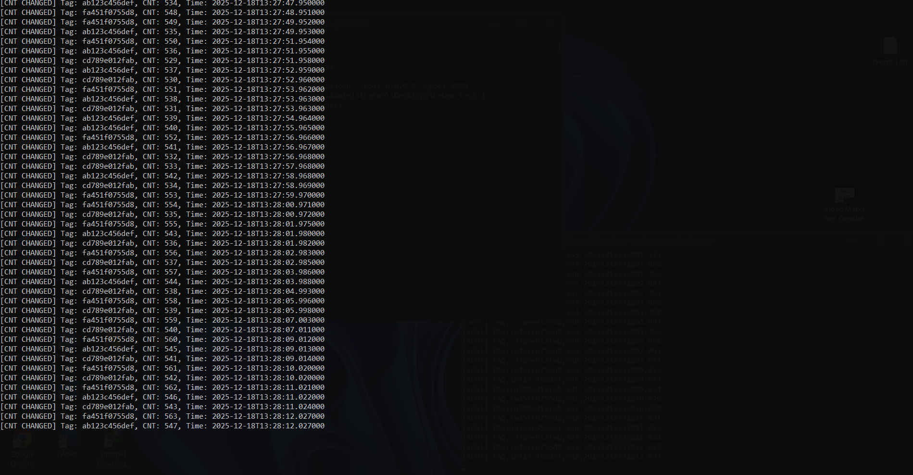
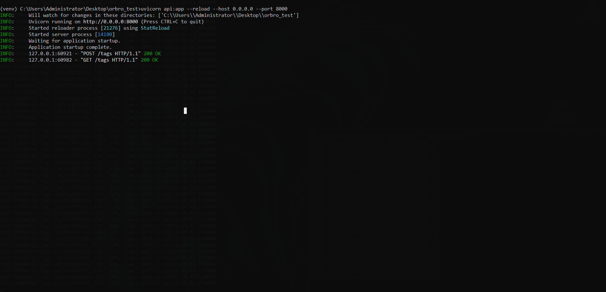
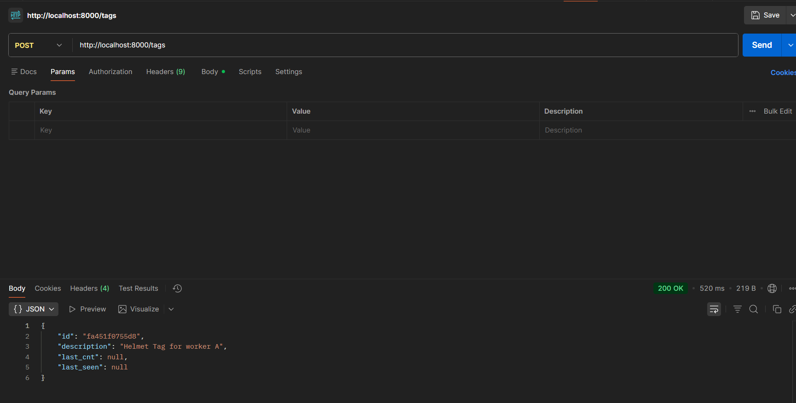
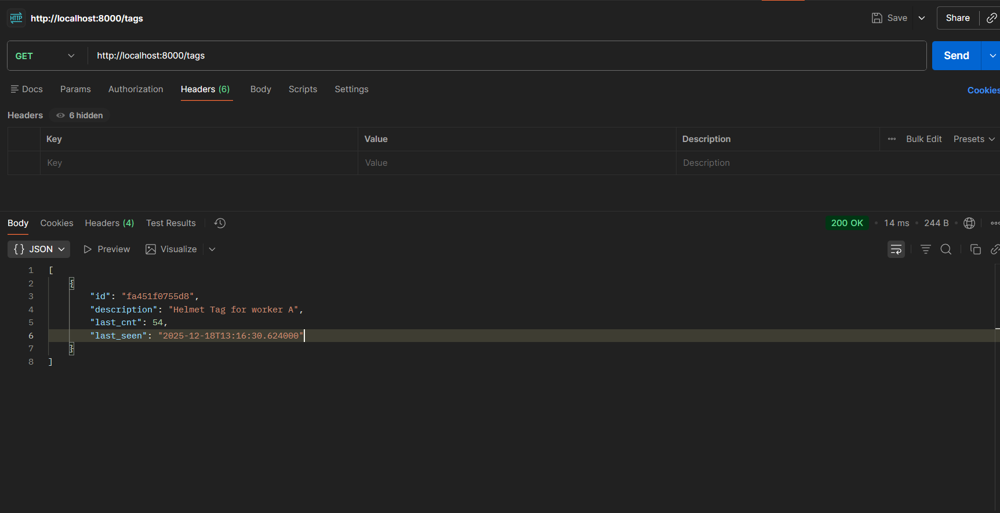
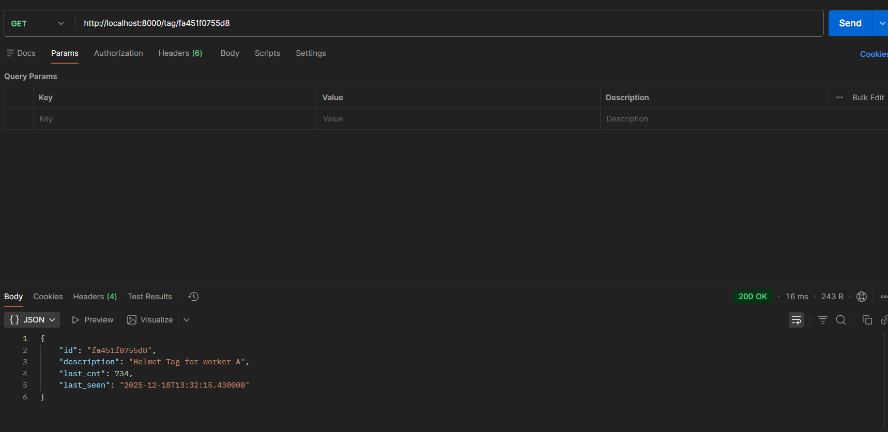
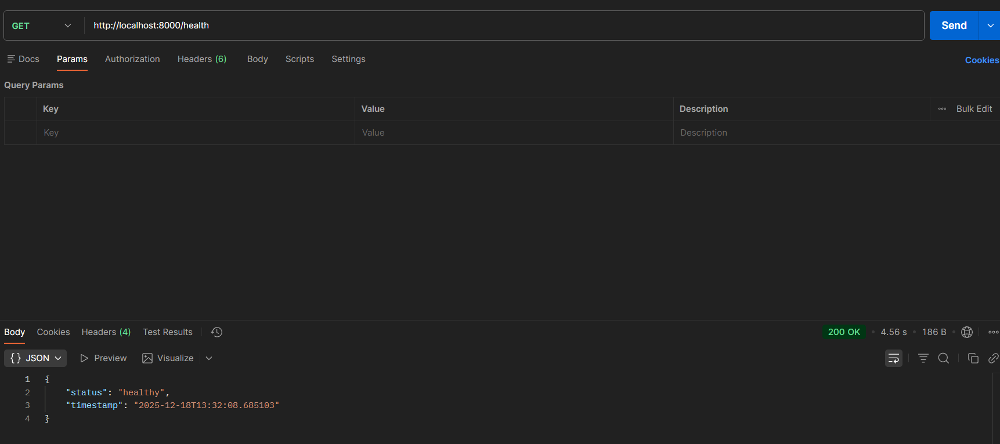

# RTLS Backend - Bài thi thực hành

Hệ thống Backend RTLS để tiếp nhận, xử lý và quản lý dữ liệu Tag.

## Cấu trúc Project

```
project_name/
├── main.py              # Server tiếp nhận UDP
├── parser.py            # Xử lý phân tích cú pháp Tag
├── api.py               # REST API (FastAPI)
├── db.py                # Logic lưu trữ SQLite
├── tag_simulator.py     # Simulator tạo dữ liệu Tag
├── requirements.txt     # Dependencies
└── README.md            # Tài liệu này
```

## Thiết lập môi trường

**Yêu cầu:** Ubuntu 20.04+ / Python 3.9+

```bash
python3 -m venv venv
source venv/bin/activate
pip install -r requirements.txt
```

## Phương pháp thực thi

### 1. Chạy Tag Simulator

Simulator tạo dữ liệu giả lập cho 3 Tag ID, gửi qua UDP socket:

```bash
python tag_simulator.py
```

**Chi tiết:**
- Gửi dữ liệu theo format: `TAG,<tag_id>,<cnt>,<timestamp>`
- Ví dụ: `TAG,fa451f0755d8,197,20240503140059.456`
- 3 Tag ID mặc định: `fa451f0755d8`, `ab123c456def`, `cd789e012fab`
- CNT tăng dần theo mỗi lần gửi
- Interval mặc định: 1 giây

### 2. Chạy Server tiếp nhận

```bash
python main.py
```

Server sẽ:
- Lắng nghe UDP port 5000
- Parse dữ liệu Tag
- Lưu trạng thái CNT và thời gian
- Xuất log khi CNT thay đổi
- Lưu vào SQLite nếu Tag đã đăng ký

### 3. Chạy API Server (FastAPI)

```bash
uvicorn api:app --reload --host 0.0.0.0 --port 8000
```

## Ví dụ API

### Đăng ký Tag

```bash
curl -X POST http://localhost:8000/tags \
  -H "Content-Type: application/json" \
  -d '{"id": "fa451f0755d8", "description": "Helmet Tag for worker A"}'
```

### Lấy danh sách Tag

```bash
curl http://localhost:8000/tags
```

### Tra cứu chi tiết Tag

```bash
curl http://localhost:8000/tag/fa451f0755d8
```

### Health Check

```bash
curl http://localhost:8000/health
```

**Response mẫu Tag:**

```json
{
  "id": "fa451f0755d8",
  "description": "Helmet Tag for worker A",
  "last_cnt": 198,
  "last_seen": "2024-05-03T14:00:59.456"
}
```

## Screenshots

### Terminal - Chạy hệ thống

**Tag Simulator:**



**Main Server (Receiver):**



**FastAPI Server:**



### Postman - Test API

**POST /tags - Đăng ký Tag:**



**GET /tags - Lấy danh sách:**



**GET /tag/{id} - Chi tiết Tag:**



**GET /health - Health Check:**



## Bài 3: Review Code và Đề xuất cải thiện

### Đoạn code cần review:

```python
tag_log = []
def log(tag_id, cnt, timestamp):
    tag_log.append((tag_id, cnt, timestamp))
```

---

### Vấn đề 1: Memory Leak (Critical)

**Mô tả:** List `tag_log` tăng vô hạn theo thời gian. Với hệ thống RTLS nhận dữ liệu liên tục 24/7, list sẽ tiêu thụ hết RAM và gây crash (OOM - Out of Memory).

**Giải pháp:**
```python
from collections import deque
tag_log = deque(maxlen=10000)  # Giới hạn 10k entries, tự động xóa cũ
```

Hoặc dùng database/file rotation.

---

### Vấn đề 2: Thread Safety (Critical)

**Mô tả:** Trong môi trường multi-thread (như FastAPI async), việc `append()` không atomic. Hai thread ghi đồng thời có thể gây race condition, corrupt data.

**Giải pháp:**
```python
import threading
lock = threading.Lock()

def log(tag_id, cnt, timestamp):
    with lock:
        tag_log.append((tag_id, cnt, timestamp))
```

Hoặc dùng `queue.Queue` cho thread-safe operations.

---

### Vấn đề 3: Global Mutable State (Serious)

**Mô tả:** `tag_log` là biến global có thể bị thay đổi từ bất kỳ đâu trong code. Điều này gây ra:
- Khó test (không thể mock/inject dependency)
- Hidden coupling giữa các module
- Side effects khó debug

**Giải pháp:**
```python
class TagLogger:
    def __init__(self):
        self._log = deque(maxlen=10000)
        self._lock = threading.Lock()
    
    def log(self, tag_id, cnt, timestamp):
        with self._lock:
            self._log.append((tag_id, cnt, timestamp))
```

---

### Vấn đề 4: No Input Validation (Serious)

**Mô tả:** Không kiểm tra dữ liệu đầu vào:
- `tag_id` có thể None hoặc empty string
- `cnt` có thể âm hoặc không phải số
- `timestamp` có thể malformed

Dữ liệu không hợp lệ sẽ gây crash hoặc corrupt database.

**Giải pháp:**
```python
def log(tag_id, cnt, timestamp):
    if not tag_id or not isinstance(tag_id, str):
        raise ValueError("Invalid tag_id")
    if not isinstance(cnt, int) or cnt < 0:
        raise ValueError("Invalid cnt")
    # Validate timestamp...
```

---

### Vấn đề 5: No Data Persistence (Serious)

**Mô tả:** Dữ liệu chỉ tồn tại trong RAM. Khi restart server hoặc crash, toàn bộ log mất hoàn toàn.

**Giải pháp:**
- Lưu vào SQLite/PostgreSQL
- Implement write-ahead logging
- Periodic flush to disk

---

### Vấn đề 6: Inefficient Query - O(n) Complexity

**Mô tả:** Để tìm log của một tag_id cụ thể phải scan toàn bộ list → O(n). Với hàng triệu entries, query sẽ rất chậm.

**Giải pháp:**
```python
# Dùng dict với tag_id làm key
tag_log = defaultdict(list)

def log(tag_id, cnt, timestamp):
    tag_log[tag_id].append((cnt, timestamp))  # O(1) lookup
```

Hoặc dùng database với index.

---

### Vấn đề 7: No Rate Limiting (Security)

**Mô tả:** Không có giới hạn số lượng log. Attacker có thể flood hệ thống với requests → DoS (Denial of Service) attack, tiêu thụ hết memory/CPU.

**Giải pháp:**
```python
from functools import lru_cache
import time

class RateLimiter:
    def __init__(self, max_per_second=1000):
        self.max_per_second = max_per_second
        self.count = 0
        self.last_reset = time.time()
    
    def allow(self):
        now = time.time()
        if now - self.last_reset > 1:
            self.count = 0
            self.last_reset = now
        self.count += 1
        return self.count <= self.max_per_second
```

---

### Vấn đề 8: No Monitoring/Metrics

**Mô tả:** Không có cách theo dõi:
- Kích thước log đang tăng bao nhiêu
- Tốc độ nhận data
- Memory usage
- Performance metrics

**Giải pháp:** Thêm metrics endpoint, logging, hoặc integrate với monitoring tools (Prometheus, Grafana).

---

### Tổng kết

| # | Vấn đề | Mức độ | Impact |
|---|--------|--------|--------|
| 1 | Memory Leak | Critical | Server crash (OOM) |
| 2 | Thread Safety | Critical | Data corruption |
| 3 | Global State | Serious | Hard to maintain/test |
| 4 | No Validation | Serious | Corrupt data, crashes |
| 5 | No Persistence | Serious | Data loss |
| 6 | O(n) Query | Medium | Performance issues |
| 7 | No Rate Limit | Medium | DoS vulnerability |
| 8 | No Monitoring | Medium | Blind operation |

## SQLite Integration

Database file: `tag_data.db`

**Tables:**
- `registered_tags`: Lưu thông tin Tag đã đăng ký (id, description, created_at)
- `tag_logs`: Lưu lịch sử dữ liệu nhận được (tag_id, cnt, timestamp, received_at)

API `/tags` và `/tag/{id}` đã được tích hợp hoạt động với SQLite database.
